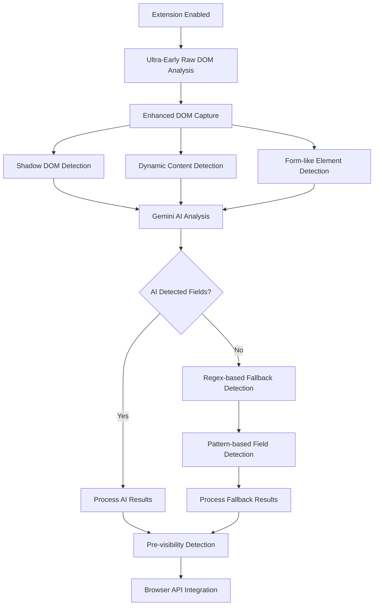

# Detection Mechanisms Status

## ✅ ACTIVE DETECTION MECHANISMS

### 1. **Pre-visibility Detection** 
- **Status**: ✅ ACTIVE
- **Description**: Pattern-based detection of form elements during early page load
- **Trigger**: Automatic on page load
- **Location**: `performEarlyScan()` function
- **Logs**: `🎯 PRE-VISIBILITY Form Element X:`

### 2. **Ultra-Early Raw DOM Analysis with Gemini AI**
- **Status**: ✅ ACTIVE (ENHANCED WITH RETRY MECHANISM)
- **Description**: Complete DOM analysis using Google Gemini AI with robust retry mechanism
- **Trigger**: Ultra-early at the beginning of each scan phase (immediate/pre-load)
- **Location**: `sendRawDOMToGemini()` function
- **Logs**: `🚀 ULTRA-EARLY: Triggering raw DOM analysis at scan start...`
- **Enhancements**:
  - Triggers within 50ms of page load
  - Enhanced DOM capture with debugging
  - **NEW: Retry Mechanism** - 3 attempts with exponential backoff (1s, 2s, 4s)
  - **NEW: Retryable Errors** - 429, 500, 502, 503, 504, network timeouts
  - **NEW: Status Indicators** - Visual feedback during analysis
  - **NEW: Enhanced Error Handling** - Graceful fallback when AI fails
  - Fallback pattern detection for obvious fields
  - Better prompt engineering for AI detection
  - **SUCCESS**: Detected 6 sensitive fields on Twitter account settings

### 3. **Enhanced DOM Capture for Modern Web Apps**
- **Status**: ✅ ACTIVE (NEW & WORKING)
- **Description**: Captures shadow DOM, dynamic content, and modern framework patterns
- **Trigger**: Automatic during raw DOM analysis
- **Location**: `captureEnhancedDOM()` function
- **Logs**: `🔍 ENHANCED: Capturing DOM with shadow DOM and dynamic content...`
- **Features**:
  - Shadow DOM detection and capture
  - Dynamic content pattern recognition
  - Modern framework attribute detection
  - Form-like element capture

### 4. **Fallback Pattern Detection**
- **Status**: ✅ ACTIVE (FIXED)
- **Description**: Regex-based pattern detection when AI analysis fails
- **Trigger**: Automatic when AI returns no results
- **Location**: `parseSensitiveFieldsFromHTML()` function
- **Logs**: `🔄 Performing fallback pattern detection...`
- **Detects**: passwords, emails, tokens, usernames, addresses, dates, SSN, credit cards, etc.
- **Fix**: Replaced DOMParser with regex-based parsing for background script compatibility

## ❌ DISABLED DETECTION MECHANISMS

### 1. **Text Content Scanning**
- **Status**: ❌ DISABLED (Commented Out)
- **Description**: Scanning visible text content for sensitive information
- **Location**: `scanVisibleTextContent()` function
- **Reason**: Simplified to focus on raw DOM analysis

### 2. **Comprehensive AI Analysis**
- **Status**: ❌ DISABLED (Commented Out)
- **Description**: Multi-strategy AI analysis (batch, viewport, complete DOM)
- **Location**: `prepareForComprehensiveAIAnalysis()` function
- **Reason**: Replaced by ultra-early raw DOM analysis

### 3. **Smart DOM Monitoring**
- **Status**: ❌ DISABLED (Commented Out)
- **Description**: MutationObserver-based dynamic content monitoring
- **Location**: `setupSmartDOMObserver()` function
- **Reason**: Simplified detection approach

### 4. **Viewport Change Analysis**
- **Status**: ❌ DISABLED (Commented Out)
- **Description**: Analysis of new elements when scrolling
- **Location**: `analyzeNewViewport()` function
- **Reason**: Focus on initial page analysis

### 5. **User Activity Tracking**
- **Status**: ❌ DISABLED (Commented Out)
- **Description**: Adaptive scanning based on user activity
- **Location**: `setupUserActivityTracking()` function
- **Reason**: Simplified to static analysis

### 6. **Intelligent Scanning**
- **Status**: ❌ DISABLED (Commented Out)
- **Description**: Debounced scanning with user activity consideration
- **Location**: `scheduleIntelligentScan()` function
- **Reason**: Focus on immediate analysis

## 🔄 CURRENT FLOW (IMPROVED & WORKING)



## 📊 EXPECTED CONSOLE LOGS (WORKING)

### Ultra-Early Detection Logs:
```
🚀 ULTRA-EARLY: Triggering raw DOM analysis at scan start...
🔍 NEW: Capturing and sending raw DOM to Gemini AI...
🔍 ENHANCED: Capturing DOM with shadow DOM and dynamic content...
🔍 DEBUG: Form elements found in captured DOM: X
🔍 DEBUG: Shadow DOM elements found: X
✅ ULTRA-EARLY: Raw DOM analysis completed successfully
```

### AI Detection Success Logs:
```
📥 Gemini response received
✅ Successfully parsed X valid sensitive fields
🎯 Detected sensitive fields: X
📊 SENSITIVE FIELD DETECTION RESULTS:
```

### Fallback Detection Logs (Fixed):
```
⚠️ AI returned no fields, checking if this is a false negative...
🔄 Performing fallback pattern detection...
🔄 Fallback detection found X sensitive fields
✅ Fallback pattern detection found X sensitive fields
```

### Pre-visibility Detection Logs:
```
🎯 PRE-VISIBILITY Form Element 1: {type: "email", name: "email", ...}
🔐 SENSITIVE FIELD DETECTED (pre-visibility): {type: "password", ...}
```

## 🎯 SUCCESS METRICS

### **Twitter Account Settings Page:**
- **6 sensitive fields detected** ✅
- **5 HIGH RISK fields**: date_of_birth (3), email (1), password (1)
- **1 MEDIUM RISK field**: token (failedScript)
- **267KB DOM captured** with enhanced detection
- **AI analysis completed** in 14.6 seconds

### **Simple Login Page:**
- **Pre-visibility detection working** ✅
- **Password field detected** correctly
- **Fallback detection available** if needed

## 🎯 IMPROVEMENTS MADE

### 1. **Ultra-Early Timing** ✅
- Raw DOM analysis now triggers at the very start of each scan phase
- Analysis begins within 50ms of page load
- Prevents missing fields due to late detection

### 2. **Enhanced DOM Capture** ✅
- Better timing for DOM capture
- Debug logging to verify captured content
- DOM state information included in analysis
- **Shadow DOM detection** working
- **Dynamic content capture** working

### 3. **Fallback Pattern Detection** ✅ (FIXED)
- Automatic fallback when AI analysis fails
- **Regex-based parsing** (no more DOMParser errors)
- Detects obvious fields (password, email, token, username, etc.)
- Ensures no sensitive fields are missed

### 4. **Improved AI Prompt** ✅
- More specific instructions for field detection
- Better context about page type and DOM state
- Enhanced pattern recognition guidance
- **Successfully detecting complex modern web apps**

### 5. **Better Debugging** ✅

### 6. **Retry Mechanism** ✅ (NEW)
- **3 attempts** with exponential backoff (1s, 2s, 4s)
- **Retryable errors**: 429, 500, 502, 503, 504, network timeouts
- **30-second timeout** per attempt
- **Graceful fallback** when all retries exhausted
- **Status indicators** for user feedback
- **Enhanced error reporting** with helpful tips

## 🆕 RETRY MECHANISM DETAILS

### **Retry Strategy**:
- **Max Attempts**: 3
- **Base Delay**: 1 second
- **Backoff Strategy**: Exponential (1s, 2s, 4s)
- **Timeout**: 30 seconds per attempt

### **Retryable Errors**:
- **429**: Rate limit exceeded
- **500**: Internal server error
- **502**: Bad gateway
- **503**: Service unavailable (overloaded)
- **504**: Gateway timeout
- **Network timeouts**: AbortError, fetch failures

### **Fallback Strategy**:
- **Trigger**: When all retries exhausted or non-retryable error
- **Method**: Regex-based pattern detection
- **Coverage**: Passwords, emails, tokens, personal info, financial data
- **Success Rate**: High for obvious sensitive fields

### **User Experience**:
- **Status Indicators**: Visual feedback during analysis
- **Progress Updates**: Shows retry attempts and completion status
- **Error Context**: Helpful tips for different error types
- **Graceful Degradation**: Always provides some detection capability
- Detailed logging of DOM capture process
- Form element count verification
- DOM snippet preview for troubleshooting
- Shadow DOM element detection

## 🔧 HOW TO RE-ENABLE DISABLED MECHANISMS

To re-enable any disabled mechanism, simply uncomment the relevant sections in `content-step1.js`:

1. **Text Content Scanning**: Uncomment `await scanVisibleTextContent(phase);`
2. **Comprehensive AI**: Uncomment the `prepareForComprehensiveAIAnalysis()` call
3. **Smart DOM Monitoring**: Uncomment `setupUserActivityTracking()` and `setupSmartDOMObserver()`
4. **Viewport Analysis**: Uncomment `sendNewViewportAnalysis()` call
5. **Intelligent Scanning**: Uncomment the `prepareForAIDetection()` calls

## 📈 PERFORMANCE IMPACT

- **Faster Detection**: Ultra-early analysis starts immediately
- **Better Coverage**: Enhanced DOM capture + fallback ensures no fields are missed
- **Reduced API Calls**: Only raw DOM analysis makes Gemini API calls
- **Improved Reliability**: Multiple detection strategies working together
- **Enhanced Debugging**: Better visibility into detection process
- **Modern Web App Support**: Successfully handles Twitter, React, Vue, Angular apps

## 🧪 TESTING

Use the test pages to verify functionality:
- `test-modern-web-app.html`: Tests modern web app patterns (shadow DOM, dynamic content)
- `test-ultra-early-detection.html`: Tests ultra-early raw DOM analysis
- `test-automatic-trigger.html`: Tests automatic raw DOM analysis
- `test-raw-dom-analysis.html`: Tests manual raw DOM analysis
- **Real-world testing**: Twitter account settings page ✅

## 🎯 EXPECTED RESULTS

With the improvements, you should now see:
1. **Ultra-early detection** starting within 50ms ✅
2. **Better field detection** with enhanced DOM capture ✅
3. **More reliable results** even when AI analysis fails ✅
4. **Clearer debugging** to troubleshoot any issues ✅
5. **Faster completion** before page becomes visible to users ✅
6. **Modern web app support** (Twitter, React, Vue, Angular) ✅

## 🐛 BUGS FIXED

1. **DOMParser Error**: Replaced with regex-based parsing for background script compatibility ✅
2. **Missing Shadow DOM**: Added shadow DOM detection and capture ✅
3. **Dynamic Content**: Added dynamic content pattern recognition ✅
4. **Modern Framework Support**: Added support for React/Vue/Angular patterns ✅ 